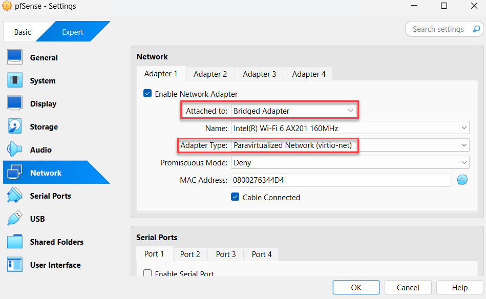
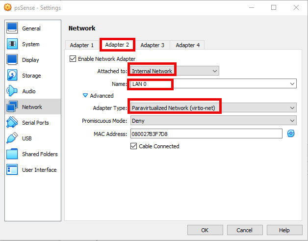
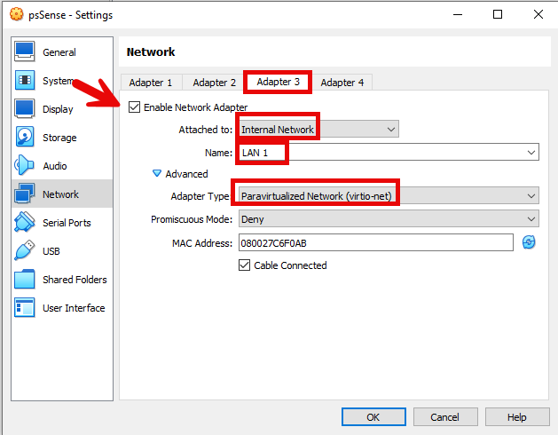

# 🛡️ Cybersecurity Virtual Lab Setup

Welcome to my personal cybersecurity lab! This repository documents how I built and configured a virtual environment using VirtualBox to practice ethical hacking, network security, and penetration testing.

## 🧰 Lab Components

My lab setup includes the following virtual machines:

| VM Name              | Purpose                                      |
|----------------------|----------------------------------------------|
| **Kali Linux**       | Main attacker box with hacking tools         |
| **Windows 10-1**     | Victim machine 1 for client-side exploits    |
| **Windows 10-2**     | Victim machine 2 (for AD or pivoting)        |
| **Metasploitable 2** | Vulnerable Linux target for testing exploits |
| **DomainController** | Windows server with Active Directory setup   |
| **pfSense Firewall** | Virtual router + firewall for segmentation   |

## 🖥️ Host System

- **Virtualization Software:** [VirtualBox](https://www.virtualbox.org/)
- **Host OS:** (Windows 10)
- **RAM:** 8GB, Minimum 16GB recommended
- **CPU:** Intel(R) Core(TM) i5-8365U CPU @ 1.60GHz 1.90 GHz
- **Disk:** 237GB

---

## 🔌 Network Topology

My lab uses **Internal Networking** in VirtualBox to simulate isolated environments. Here’s how it's wired:

- **pfSense** serves as the gateway/firewall.
- All machines connect through pfSense.
- Different subnets are used for segmentation and attack simulation.
- Internet access can be optionally bridged through pfSense.

## 🔧 VM Configuration Summary

| VM               | CPU | BASE MEMORY   | Network Adapter  | Notes                                       |
|------------------|-----|---------------|------------------|---------------------------------------------|
| Kali Linux       | 2   | 2084MB        | Bridged Adapter  | INTERACTS REAL DEVICES ON THE NETWORK       |
| Windows 10 1/2   | 2   | 2050MB        | Internal Network | WIN10-1 & WIN10-2 BOTH ON LAN 1             |
| Metasploitable   | 1   | 1024MB        | Internal Network | LAN 1                                       |
| DomainController | 1   | 2048MB        | Internal Network | LAN 1 + DNS roles installed                 |
| pfSense          | 2   | 2024MB        | NAT              | Routes traffic + firewall rules             |

---

## 📌 Goals for This Lab

- Practice ethical hacking with tools like Nmap, Metasploit, Burp Suite, and BloodHound.
- Learn Active Directory exploitation.
- Simulate real-world attack vectors safely.
- Set up detection and defense mechanisms (e.g., logs, rules).
- Prepare for certifications like OSCP, CEH, Security+.

---

## 🚧 Future Plans

- Add ELK stack or Security Onion for detection.
- Integrate SIEM tools for logging.
- Expand to cloud attack simulations.

---

## 📸 Screenshots

### 🪟 Win10 VM Setup

### 🔥 pfSense Firewall

### 🐉 Kali Linux

### Metasploitable

### lab_topology

### domainController

## 🤝 Contributing

This is a personal learning project, but if you'd like to suggest improvements or collaborate, feel free to fork and open a PR!

---

## 📜 License

This project is open source under the MIT License.